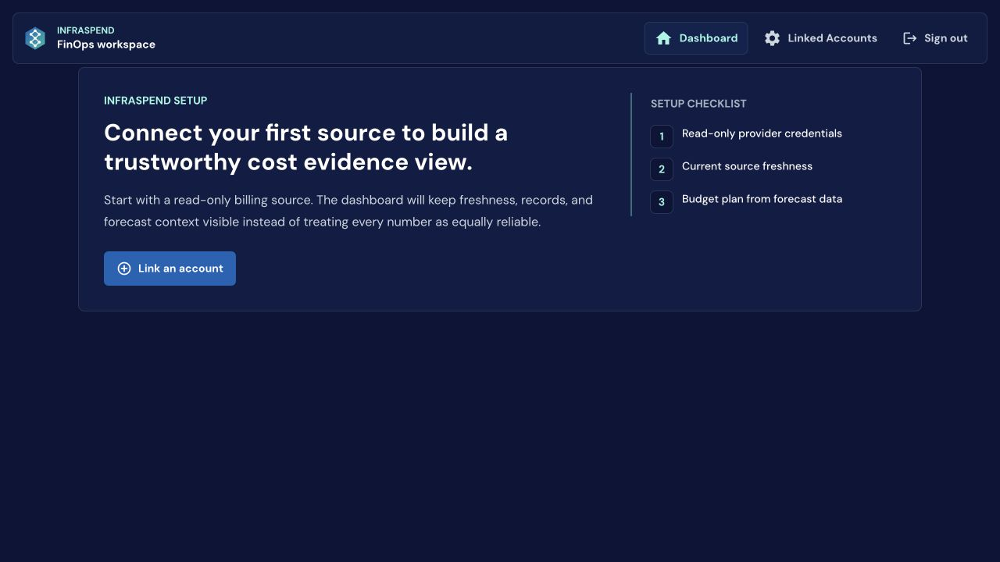
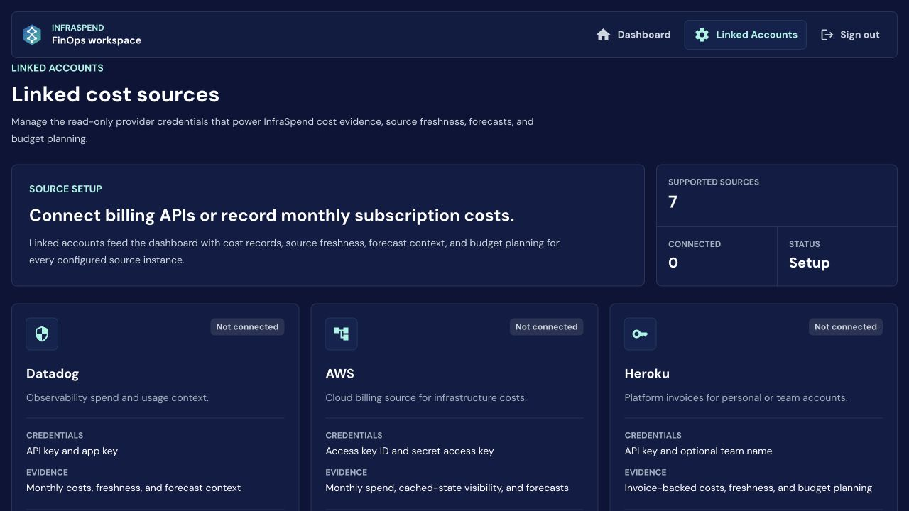
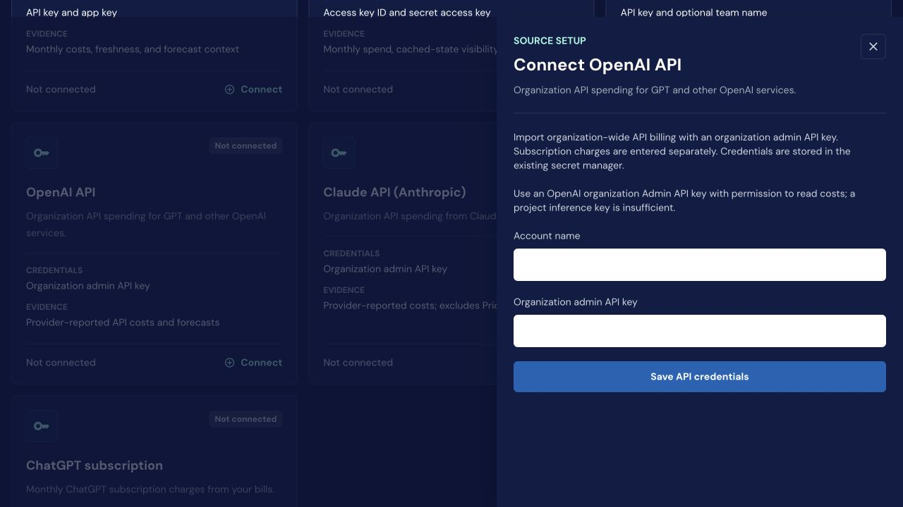
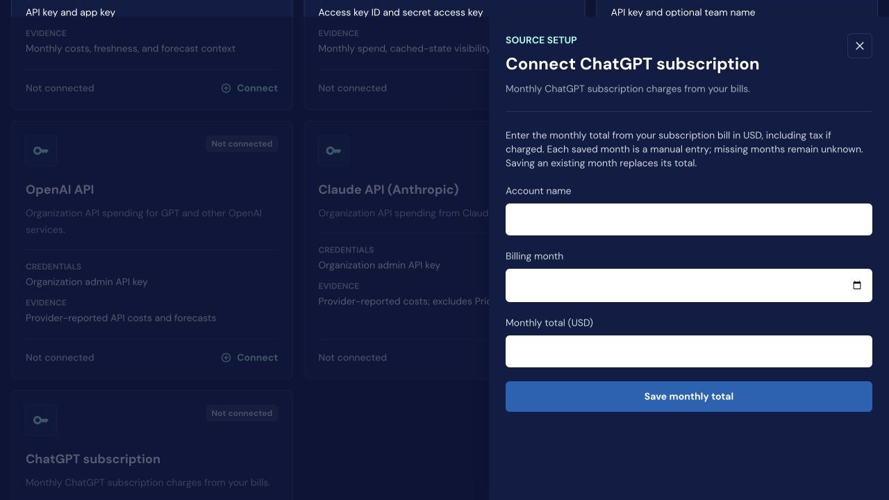
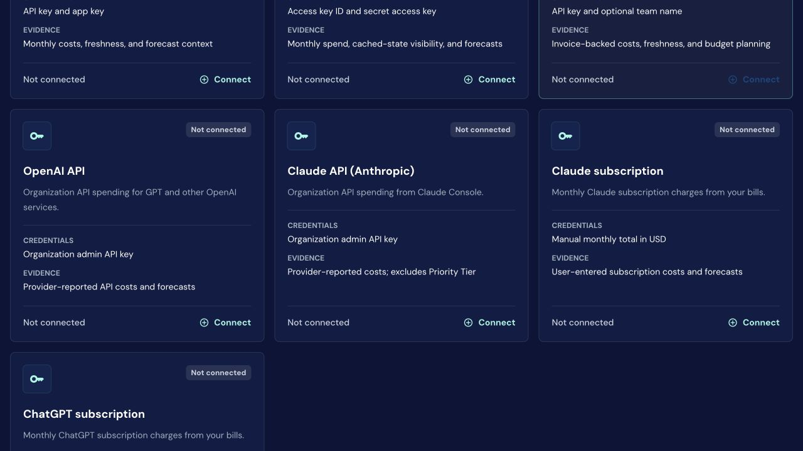

# InfraSpend design review — September 15, 2026

## Recommendation

Make InfraSpend the place where an engineering budget owner can answer: **Can we afford this AI workload, which change is worth testing, and did it actually improve our economics?**

Keep the approved SaaS/cloud/AI monitoring and budget identity. Use one AI planning workflow as the first focused proof. Transparent evidence should make the decision credible; the interface should lead with the decision itself.

This is a design recommendation and a discovery hypothesis, not validated demand or an approved implementation queue.

## Scope and evidence

- Inspected the live authenticated session at https://infraspend.io in a visible browser at its normal 1280×720 viewport.
- The session showed zero connected sources. Reviewed the dashboard empty state, source catalog, OpenAI API drawer, and manual ChatGPT subscription drawer. No credentials or billing entries were submitted.
- Captured five screenshots below. Populated production dashboards, budget persistence, imports, mobile layouts, and optimization outcomes were not exercised.
- Compared with Product Brain branch `product-brain/2026-09-14` at `5114c179a252a634c43ce9e67422801f1e6cefbd`; the remote branch hash was verified during this review. This is the September 14 research branch, not a claim about its merge status. The knowledge-base default working directory was still on the July 19 baseline and was not used as the current roadmap.
- Inspected implementation checkout `5c10566`, including `VendorDetails.tsx`, `VendorMetrics.tsx`, and `forecast_service.py`. Code inspection is distinct from live verification.

## UI findings

| Priority | Observed experience | Why it matters | Recommended change |
|---|---|---|---|
| P0 | Account name has an accessibility value of “Default Configuration,” but appears blank on the white input. The subscription month similarly has a value of `2026-09` that is not readable in the screenshot. | People cannot confidently review setup values. | Fix input text/background contrast, including default values, dates, focus, errors, and autofill. Verify in the actual browser. |
| P1 | Dashboard headline leads with “trustworthy cost evidence view.” | Describes the mechanism before the user benefit. | Lead with “Plan your AI and engineering spend.” Explain source coverage and freshness underneath. |
| P1 | Empty workspace offers one route: connect an account. | Requires trust and credentials before demonstrating value. | Add a clearly labeled sample workspace and a lightweight manual-budget path. Keep sample and real totals unmistakably separate. |
| P1 | Datadog, AWS, and Heroku occupy the first source row; AI sources appear lower down. | AI cost planning is difficult to recognize as the main use case. | Group AI APIs, AI subscriptions, and cloud/other tools. Put AI groups first for the proposed entry flow. |
| P1 | Source setup has a title, explanatory paragraph, another large explanatory card, and a supported-source count before actionable cards. | Much of the first viewport repeats setup context. | Compress to one introduction and a compact connection summary; bring choices above the fold. |
| P1 | API drawer says credentials use the “existing secret manager,” with no visible guided key-creation link or import expectations. | Implementation wording does not answer the user's setup questions. | Show the verified required permission, where to obtain it, data coverage, exclusions, import cadence, and expected first result. Describe actual access scope accurately. |
| P2 | Manual subscription entry is labeled “Connect”; its catalog card labels a monthly total as “CREDENTIALS.” | Suggests automation and authentication where the user is recording a bill. | Use “Add monthly bill,” “Entry method,” and “Manually maintained.” |
| P2 | Only Dashboard and Linked Accounts are visible in primary navigation. | Budget planning has little visible product prominence in this empty state. | As the workflow is built, organize around Overview, Plan, and Actions, with Sources as supporting setup. Do not add empty navigation destinations. |

### Preserve

The navy/teal palette, type hierarchy, contained setup drawer, and clear primary buttons form a usable visual foundation. The source catalog correctly distinguishes API charges from manual subscriptions and discloses Anthropic Priority Tier exclusions. Missing subscription months remain unknown. These are valuable trust decisions.

The largest design improvement is a clearer workflow and information hierarchy; a cosmetic redesign alone will not establish the product.

## What already exists versus what remains unproven

The implementation has account-specific monthly budgets, forecast views, budget editing/saving, and CSV export. Do not start by rebuilding these features. The local forecast service uses completed consecutive months and illustrative growth variations; it explicitly does not calculate statistical confidence intervals.

Design consequence: use labels such as “Lower-growth scenario,” “Historical trend,” and “Higher-growth scenario.” Explain baseline, exclusions, and insufficient history. A budget is the amount someone authorizes; a forecast is an estimate; a scenario is a conditional assumption. Keep those meanings separate.

Because the live account had no sources, this review cannot establish how those populated workflows currently feel or whether production saves and imports succeed.

## Fit with the September 14 Product Brain

| Roadmap direction | Assessment |
|---|---|
| O-001: evidence-grade AI/Kubernetes allocation; NOW, discovery | Existing billing and freshness foundations fit. Source totals and health presentation do not yet prove allocation, complete lineage, or competitive advantage. |
| O-002: investigation to owned action; NOW, discovery | The inspected live entry flow does not demonstrate an actionable recommendation, owner, disposition, or verified outcome. This remains a discovery opportunity. |
| O-003: business-context forecasting; LATER | A planning interface is necessary to fulfill the approved product identity, but a generic scenario engine is not a defensible standalone wedge. |
| O-005: service-aware guardrails; LATER | Treat a saved budget as a planning target. Do not imply that it caps provider spend. |
| Q-001–Q-004 complete; no next ready task | Avoid duplicating foundation work. The research still requires buyer selection, permitted fixtures, an observation boundary, and measurable differentiation. |

There is a strategic tension worth resolving explicitly: founder positioning centers on monitoring and budgets, while the discovery roadmap centers on allocation and investigations. Make planning the user-facing workflow and evidence/owned actions its supporting capabilities. Record this as a roadmap decision if validated.

The current roadmap also couples the first O-001 proof to Kubernetes. My recommendation is to test an API-first AI workload with two billing sources before requiring Kubernetes. That is a proposed narrowing of the discovery scope, not an interpretation that the existing gate has already been satisfied. Add Kubernetes when a design partner's decision requires it.

## Proposed product journey

### 1. Overview: “Are we on plan?”

Show the chosen period, recorded spend, approved budget, forecast range where supportable, and projected budget gap. Present a concise coverage statement beside the totals: which providers and dates are included, and what is missing. Provide a breakdown by workload/team when attribution exists; preserve “Unallocated” otherwise.

Separate API consumption, fixed subscriptions, and cloud infrastructure. Do not infer unused seats or model efficiency from a monthly subscription total. Separate billed, provider-reported, manual, and estimated amounts before combining them.

### 2. Plan: “What happens if we change this?”

For one AI workload, compare the current plan with one alternative. Inputs should be operationally meaningful: expected tasks, calls per task, input/output tokens, cache behavior, model mix, retries, and fixed charges, but only where supported by the chosen data boundary.

Every assumption should show whether it was observed, entered by a person, or inferred. Prices need a provider, effective date, and relevant rate conditions. Preserve a baseline and version of the scenario so the plan can later be compared with results.

This must help a specific person make a real decision. A larger list of controls or model prices is not proof of value.

### 3. Action: “Which change is worth testing?”

Present one finite proposal with an owner, supporting records, estimated impact range, effort, quality/latency constraints, and a measurement plan. Possible changes include reducing retries, caching repeated context, or testing a cheaper model on a suitable workload. Monthly provider totals alone cannot substantiate these recommendations; additional permitted usage and outcome data is required.

Use states such as Proposed → Accepted → Testing → Measured, with Deferred and Rejected available. An observed spend drop is not automatically a saving: compare equivalent volumes, prices, and quality, and expose confounding changes.

The strongest hypothesis is an inspectable chain from **source record → planning assumption → engineering change → measured outcome**. It is not proven unique or valuable until compared with a customer's current process and incumbent tools.

## What to do next

### First: make the existing experience legible

Fix setup input contrast, simplify repeated copy, elevate AI source choices, and distinguish manual entry from connections. Surface the existing budget workflow more clearly. Build a labeled sample journey that demonstrates one planning decision before requesting credentials.

Acceptance: a first-time user can identify what InfraSpend helps them decide, choose API versus subscription correctly, and read every form value. The sample must never resemble their actual bill.

### Second: validate one buyer and one recurring decision

Working hypothesis: an engineering lead at a small team using multiple AI APIs who owns a monthly tools/workload budget. Confirm this instead of designing simultaneously for enterprise FP&A, GPU platform teams, and individual subscribers.

Use the roadmap's five interviews and two design partners. Ask for the last real budget decision, current spreadsheet/tool, data they were missing, time spent, deadline, and who could pay. Obtain two explicitly permitted fixture sets and select the observation boundary.

Prototype one scenario and one measurable optimization action. Evaluate against the customer's current process. Suggested pilot targets—not existing results or customer commitments—are a reviewed plan within 15 minutes after data is available, no unexplained difference in supported fixture totals, and a recipient able to accept or reject the proposed action without rebuilding the evidence.

### Third: implement only the successful slice

Create a bounded task after the pilot establishes the exact data, calculation, owner, and outcome criterion. Measure time to first usable plan, source coverage, unexplained reconciliation variance, decision completion, accepted actions, forecast error after period close, and verified outcome evidence. Do not optimize for dashboard views or recommendation count.

Avoid broad connector expansion, autonomous enforcement, a generic cost chatbot, or a full Kubernetes allocation platform until the selected buyer's workflow justifies them.

## Current competitive check

- Vantage documents forecasts driven by projected business metrics and reusable scenario adjustments: [Forecasting](https://docs.vantage.sh/forecasting), [Scenario Model Forecasting](https://www.vantage.sh/blog/scenario-model-forecasting).
- Finout markets AI allocation, budgets/alerts, and connections between spend and business outcomes: [AI cost management](https://www.finout.io/artificial-intelligence), [AI business outcomes](https://www.finout.io/blog/how-finout-connects-ai-spend-to-real-business-outcomes?hs_amp=true).

These are documented vendor capabilities/claims, not independently tested performance or InfraSpend buyer demand. They support the roadmap's warning that planning controls and unit-economics labels alone are insufficient differentiation.

## Screenshots

### 1. Live dashboard empty state

### 2. Source catalog, first viewport

### 3. OpenAI connection drawer

### 4. Manual ChatGPT subscription drawer

### 5. AI source catalog lower on the page

